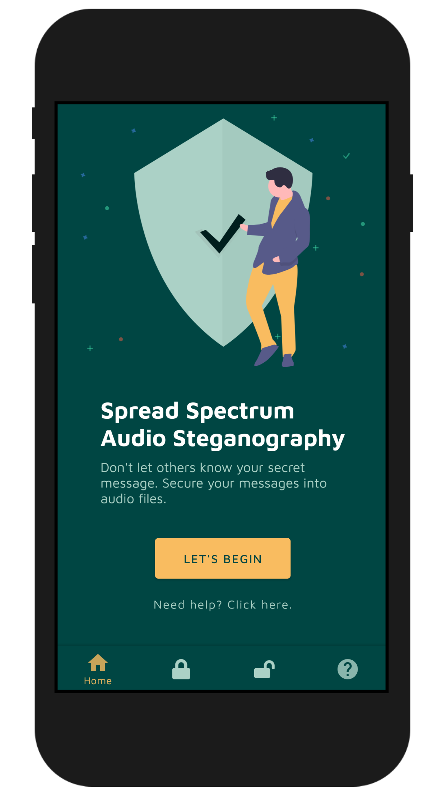
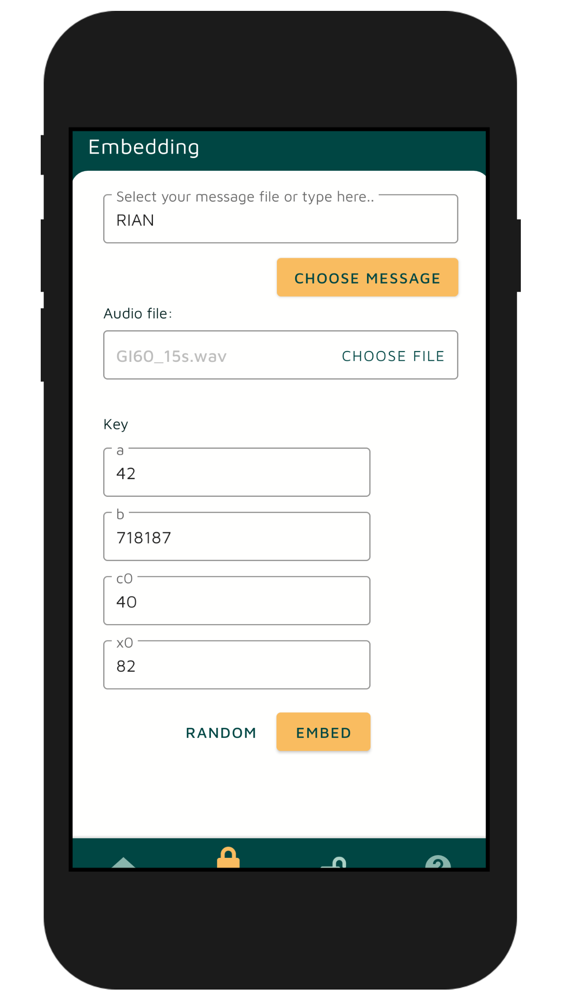
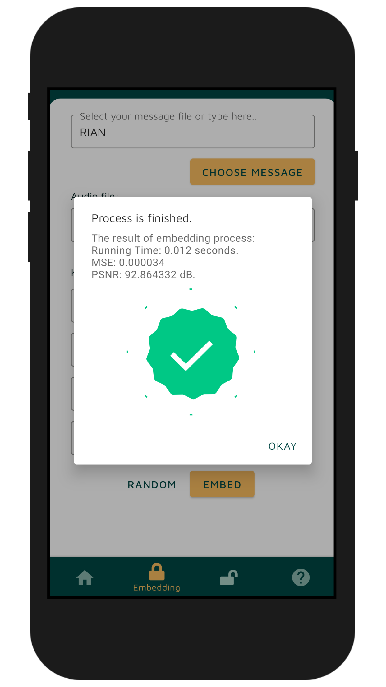
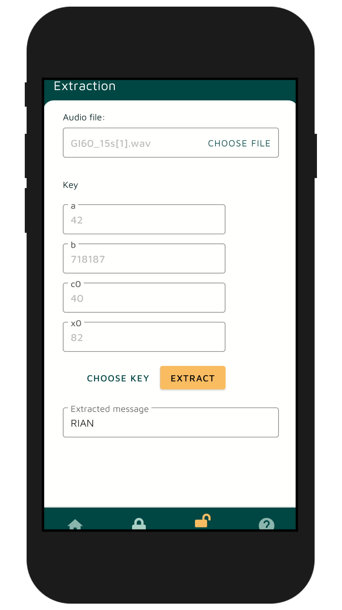
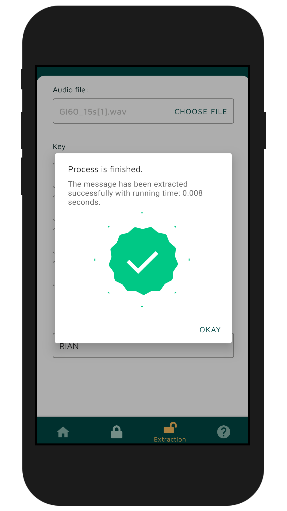
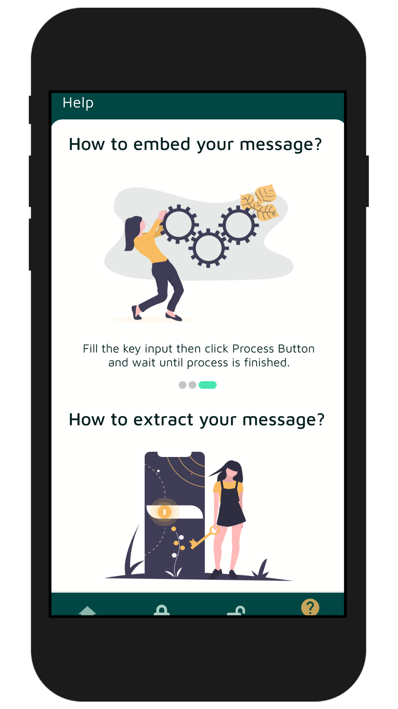

# Spread Spectrum Steganography

An android application that can insert text messages into audio files with steganography techniques using the Modified Least Significant Bit algorithm.
Before a text message is inserted into an audio file, the message bits are spread first using the spread spectrum technique.
For more details, you can read about this research here(soon).

## Screenshot

